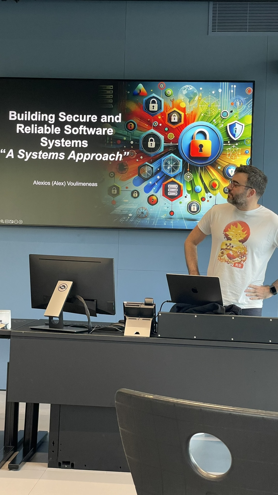
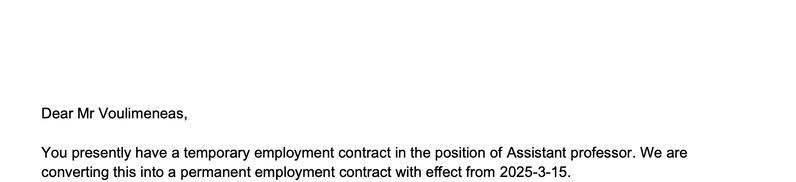
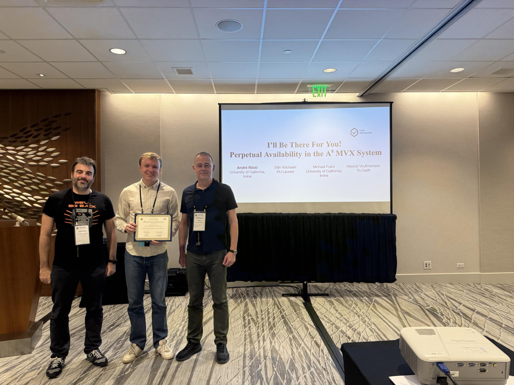
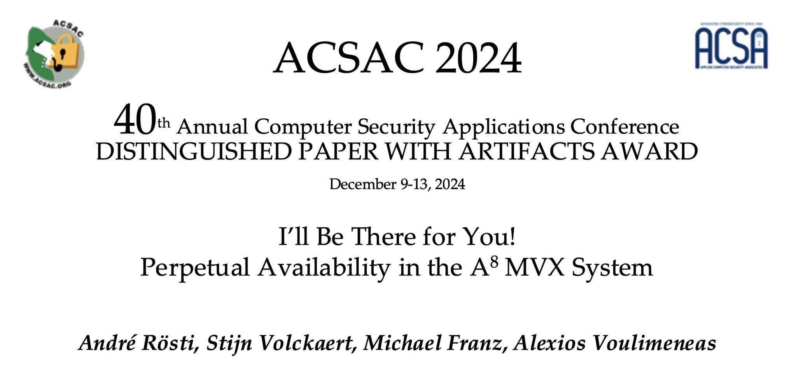

## News

**March 2025:** Our paper "Divide and Conquer: Introducing Partial Multi-Variant Execution" got accepted at Euro S&P 2025. Congrats Jonas, Adriaan, and Stijn.   

**February 2025:** Tenure, finally—through blisters and bedrock!

This would never have been possible without the unwavering support of so many people, both professionally and personally. Grateful beyond words for the mentors, colleagues, friends, and family who guided, encouraged, and believed in me through every challenge and milestone!

**December 2024:** We won one of the two awarded Best Paper Awards at ACSAC 2024 (out of a total of 83 accepted papers / 424 total papers submitted to the conference / 381 strictly reviewed papers after desk rejects).

Congratulations and thanks to my co-authors André, Stijn, and Michael!

 

## Bio

I am a tenured Assistant Professor in the [Cybersecurity](https://www.tudelft.nl/en/eemcs/the-faculty/departments/intelligent-systems/cybersecurityeemcs/people) research group at [TU Delft](https://www.tudelft.nl/). I am also part of TU Delft's Undergraduate Curriculum Committee.

From September 2020 until August 2023, I was a Postdoctoral Scholar in the [DistriNet](https://distrinet.cs.kuleuven.be/) research group at [KU Leuven's Technology Campus](https://iiw.kuleuven.be/english/ghent/ghent) in Ghent, Belgium.

I obtained my PhD degree from [UC Irvine](https://uci.edu/) in 2020 under the supervision of Professor [Michael Franz](http://www.michaelfranz.com/).
In my [PhD dissertation](https://escholarship.org/uc/item/2719443b), I proposed new techniques to improve the security and performance of N-Variant eXecution (NVX) systems. Before that, I completed my undergraduate studies at [Athens University of Economics and Business/Department of Informatics, Greece](https://www.dept.aueb.gr/en/cs). I have also done internships at Oracle Labs and Apple. You can contact me at A.Voulimeneas AT tudelft DOT nl or [Twitter](https://twitter.com/systemsgreek).

[(link to full CV)](./Voulimeneas_Alexios_academic_CV.pdf)

## Research

My research interests include:

*   Systems Security
*   Operating Systems
*   Computer Networks and Distributed Systems

## Publications

Divide and Conquer: Introducing Partial Multi-Variant Execution [[PDF]](./papers/eurosp2025pmvx.pdf)    
Jonas Vinck, Adriaan Jacobs, Alexios Voulimeneas, and Stijn Volckaert.    
(To Appear) In IEEE European Symposium on Security and Privacy (Euro S&P 2025).

Moneta: Ex-Vivo GPU Driver Fuzzing by Recalling In-Vivo Execution States [[PDF]](https://www.ndss-symposium.org/wp-content/uploads/2025-218-paper.pdf)[[code]](https://github.com/yonsei-sslab/moneta)  
Joonkyo Jung, Jisoo Jang, Yongwan Jo, Jonas Vinck, Alexios Voulimeneas, Stijn Volckaert, and Dokyung Song.  
In Network and Distributed System Security Symposium (NDSS 2025).  
**[Acceptance Rate: 211/1311=16.1%]**  

I’ll Be There for You! Perpetual Availability in the A8 MVX System [[PDF]](./papers/a8acsac2024.pdf)[[code]](https://github.com/andrej/a8)     
André Rösti, Stijn Volckaert, Michael Franz, and Alexios Voulimeneas.  
In Annual Computer Security Applications Conference (ACSAC 2024).  
**Distinguished Paper with Artifact Award**  
**[Acceptance Rate: 83/381=21.8%]** (83 papers accepted out of 424 total papers submitted to the conference / 381 strictly reviewed papers after what the program committee called "aggressive desk rejects" = 21.8% of the actually reviewed papers)   
**Artifact Evaluation Badges:**   

The Astonishing Evolution of Probabilistic Memory Safety: From Basic Heap-Data Attack Detection towards Fully Survivable Multi-Variant Execution [[PDF]](./papers/The_Astonishing_Evolution_of_Probabilistic_Memory_Safety_From_Basic_Heap-Data_Attack_Detection_Toward_Fully_Survivable_Multivariant_Execution.pdf)  
André Rösti, Alexios Voulimeneas, and Michael Franz.  
In IEEE Security & Privacy 2024.

Orbital Shield: Rethinking Satellite Security in the Commercial Off-the-Shelf Era [[PDF]](./papers/ESA3S-2024.pdf)      
Nikita Yadav, Franziska Vollmer, Ahmad-Reza Sadeghi, Georgios Smaragdakis, and Alexios Voulimeneas.  
In IEEE Conference on Security for Space Systems (3S) 2024.  

System Call Interposition Without Compromise [[PDF]](./papers/2024-lazypoline.pdf)[[code]](https://github.com/lazypoline/lazypoline)  
Adriaan Jacobs, Merve Gülmez, Alicia Andries, Stijn Volckaert, and Alexios Voulimeneas.  
In IEEE/IFIP International Conference on Dependable Systems and Networks (DSN 2024).  
**[Acceptance Rate: 42/203=20%]**  
**Artifact Evaluation Badges:**   

A run a day won’t keep the hacker away: Inference attacks on endpoint privacy zones in fitness tracking social networks  
Karel Dhondt, Victor Le Pochat, Alexios Voulimeneas, Wouter Joosen, and Stijn Volckaert.  
In BlackHat Asia 2023.

A run a day won’t keep the hacker away: Inference attacks on endpoint privacy zones in fitness tracking social networks [[PDF]](https://lepoch.at/files/epz-inference-attacks-ccs22.pdf)  
Karel Dhondt, Victor Le Pochat, Alexios Voulimeneas, Wouter Joosen, and Stijn Volckaert.  
In ACM Conference on Computer and Communications Security (CCS 2022).  
**[Acceptance Rate: 218/971=22.5%]**  

You Shall Not (by)Pass! Practical, Secure, and Fast PKU-based Sandboxing [[PDF]](./papers/cerberus.pdf)[[code]](https://github.com/ku-leuven-msec/The-Cerberus-Project)[[slides]](./papers/EuroSys22_Cerberus.pptx)    
Alexios Voulimeneas, Jonas Vinck, Ruben Mechelinck, and Stijn Volckaert.  
In European Conference on Computer Systems (EuroSys 2022).  
**[Acceptance Rate: 42/162=25.9%]**

Sharing is Caring: Secure and Efficient Shared Memory Support for MVEEs [[PDF]](./papers/eurosys22-final50.pdf)[[code]](https://github.com/ReMon-MVEE/ReMon)[[slides]](./papers/EuroSys22_ReMon_Shm.pptx)      
Jonas Vinck, Bert Abrath, Bart Coppens, Alexios Voulimeneas, Bjorn De Sutter, and Stijn Volckaert.  
In European Conference on Computer Systems (EuroSys 2022).  
**[Acceptance Rate: 42/162=25.9%]**

dMVX: Secure and Efficient Multi-Variant Execution in a Distributed Setting [[PDF]](https://arxiv.org/pdf/2011.02091.pdf)[[video]](https://www.youtube.com/watch?v=Cn88HpelxHo&list=PLzDuHU-z7gNimkcmxRESHgdi-tBWoFWhH&index=7&ab_channel=AndreaLanzi)[[slides]](./papers/dMVX-eurosec2021.pptx)  
Alexios Voulimeneas, Dokyung Song, Per Larsen, Michael Franz, and Stijn Volckaert.  
In European Workshop on Systems Security (EuroSec 2021).

Building the Next Generation of Security Focused NVX Systems:Overcoming Limitations of N-Variant Execution [[PDF]](https://escholarship.org/uc/item/2719443b)[[slides]](./papers/voulimeneas_defense.pptx)  
Alexios Voulimeneas.
PhD dissertation, UC Irvine, 2020.

Distributed Heterogeneous N-Variant Execution [[PDF]](./papers/dimva20-paper27-final.pdf)[[video]](https://www.youtube.com/watch?v=8AOwFWC3KjY&list=PLm_RjVa4jQG9hGaSZQcsWgFO87CA_iTzq&index=8&t=0s)[[slides]](./papers/dimva20-presentation.pptx)  
Alexios Voulimeneas, Dokyung Song, Fabian Parzefall, Yeoul Na, Per Larsen, Michael Franz, and Stijn Volckaert.  
In International Conference on Detection of Intrusions and Malware
& Vulnerability Assessment (DIMVA 2020).  
**[Acceptance Rate: 13/45=28.9%]**

Secure and Efficient Application Monitoring and Replication [[PDF]](https://people.cs.kuleuven.be/~stijn.volckaert/papers/2016_ATC_ReMon.pdf)[[code]](https://github.com/ReMon-MVEE/ReMon)  
Stijn Volckaert, Bart Coppens, Alexios Voulimeneas, Andrei Homescu, Per Larsen, Bjorn De Sutter, and Michael Franz.  
In USENIX Annual Technical Conference (ATC 2016).  
**[Acceptance Rate: 47/266=17.6%]**

A Reliable Multicast Transport Protocol for Information-Centric Networks [[PDF]](https://mm.aueb.gr/publications/2014-RMTPSI-JNCA.pdf)  
Charilaos Stais, George Xylomenos, and Alexios Voulimeneas.  
In Journal of Network and Computer Applications (JNCA 2014).  

Towards an Error Control Scheme for a Publish/Subscribe Network [[PDF]](https://mm.aueb.gr/publications/2013-ECOPSUN-ICC.pdf)  
Charilaos Stais, Alexios Voulimeneas, and George Xylomenos.  
In International Conference on Communications (ICC 2013).  

Towards an Error Control Scheme for a Publish/Subscribe Network [[PDF]](./papers/reportFINAL.pdf)  
Alexios Voulimeneas.  
B.Sc. Thesis Project report, Athens University of Economics and Business/Department of Informatics, 2012.

##  Professional Service

(HotOS) ACM SIGOPS Workshop on Hot Topics in Operating Systems, Proceedings Chair [2027]  

(SOSP) ACM Symposium on Operating Systems Principles, Artifact Evaluation Committee Chair [2026]    

(ACSAC) Annual Computer Security Applications Conference, Program Committee [2025]  

(SYSTOR) ACM International Systems and Storage Conference, Program Committee [2025]   

(EuroSys) European Conference on Computer Systems, Proceedings Chair [2025]  

(ACNS) International Conference on Applied Cryptography and Network Security, Program Committee [2025]  

(S&P) IEEE Symposium on Security and Privacy, Program Committee [2025, 2026]  

(USENIX Security) USENIX Security Symposium, Program Committee [2024, 2025, 2026]   

(Middleware) ACM/USENIX/IFIP International Middleware Conference, Program Committee [2023, 2025] 

(ISC) Information Security Conference, Program Committee [2024, 2025]  

(EuroSec) European Workshop on System Security, Program Committee  [2024, 2025]  

(DIMVA) Conference on Detection of Intrusions and Malware & Vulnerability Assessment, Program Committee [2024]  

(CCS) ACM Conference on Computer and Communications Security, Program Committee [2023, 2024]  
**[Top Reviewer Award, 2023]**  

(USENIX Security) USENIX Security Symposium, Artifact Evaluation Publication Chair [2023]

(EuroSys) European Conference on Computer Systems, Program Committee [2023]

(ASIACCS) ACM ASIA Conference on Computer and Communications Security, Program Committee [2023, 2024]  
**[Best Reviewer Award, 2023]**  

(ESORICS) European Symposium on Research in Computer Security, Program Committee [2022, 2023]

(PLDI) ACM SIGPLAN Conference on Programming Language Design and Implementation, Artifact Evaluation Committee [2022]

(EuroSys) European Conference on Computer Systems, Artifact Evaluation Committee [2022]  
**[Distinguished Reviewer Artifact Award, 2022]**

(USENIX Security) USENIX Security Symposium, Artifact Evaluation Committee [2022] 

(EuroSys) European Conference on Computer Systems, External Reviewer [2021, 2022]

(ROOTS) Reversing and Offensive-oriented Trends Symposium, Program Committee [2020, 2021, 2022]

(OSDI) USENIX Symposium on Operating Systems Design and Implementation, Artifact Evaluation Committee [2020] 

(S&P) IEEE Symposium on Security and Privacy, Student Program Committee Member [2018]  

##  Teaching

[Since 2024] Computer Security  

[Since 2024] Systems Security

##  Current PhD Students

Jesús María Gómez Moreno (2024-Present, TU Delft)  

##  Current Master Thesis Students  

Vissarion Moutafis (2024-Present, TU Delft)  
Ali Kahawati (2024-Present, TU Delft)   

##  Graduated Master Thesis Students

Wouter Jehee (MSc 2024, TU Delft)  
